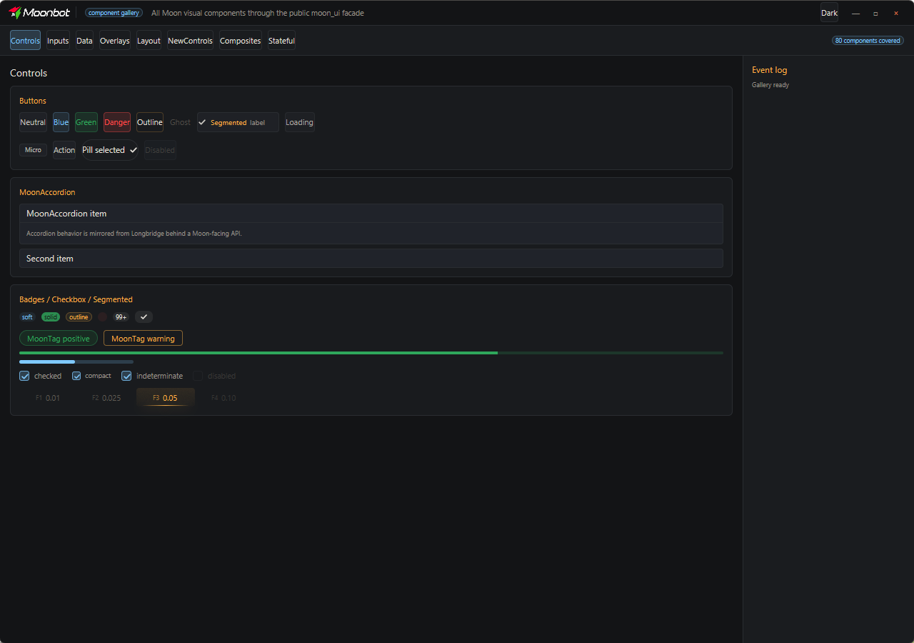
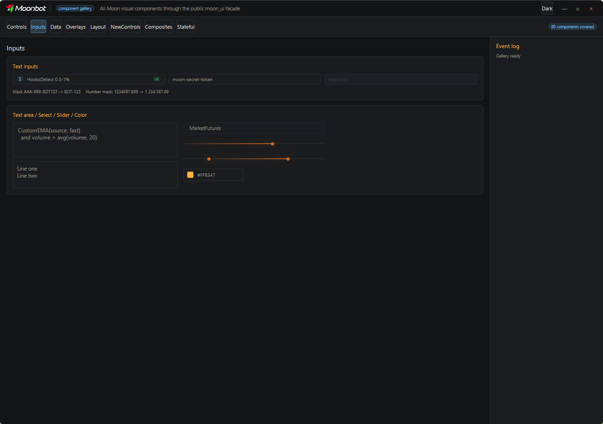
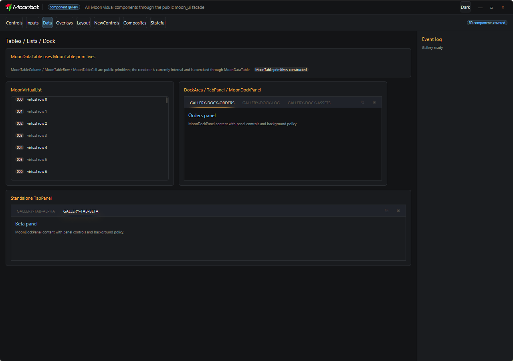
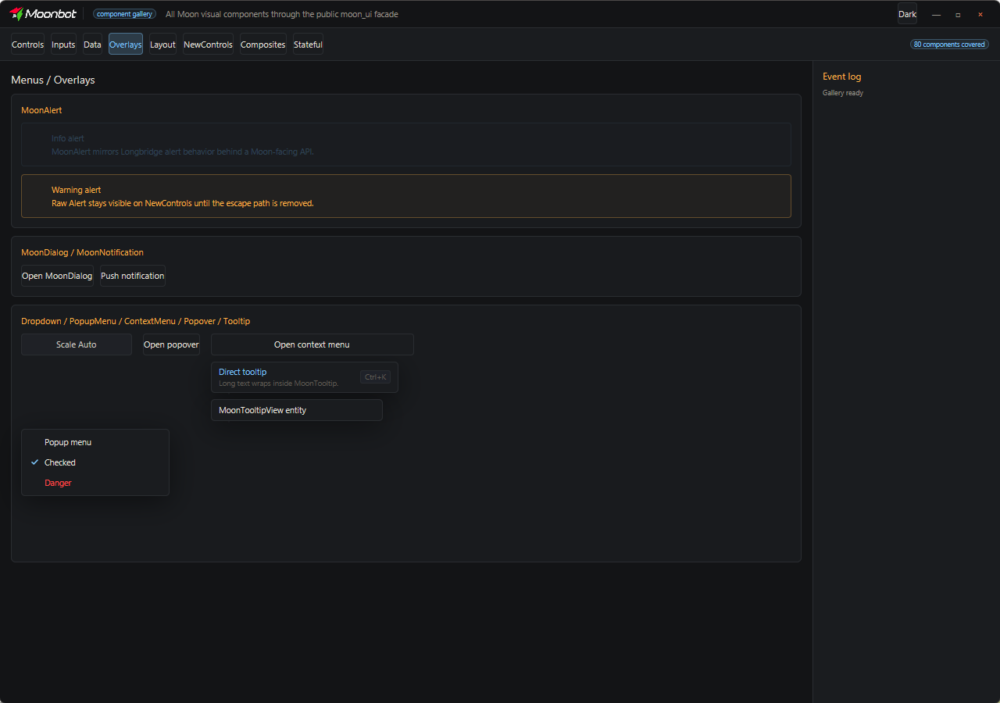
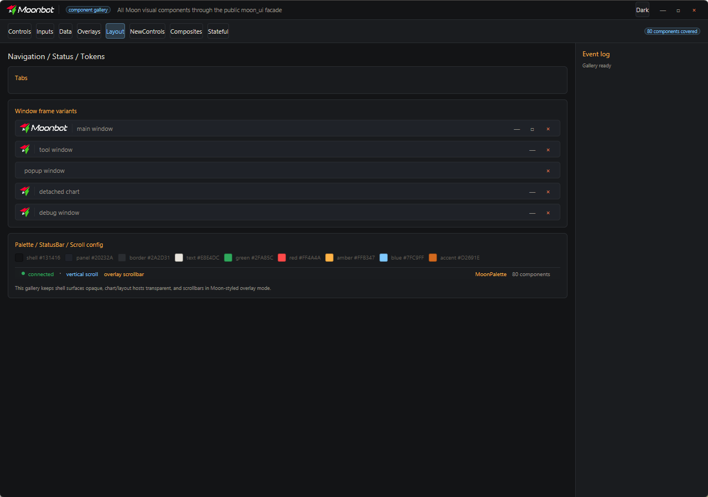

<p align="center">
  <a href="https://moonbot.pro">
    
  </a>
</p>

<h1 align="center">MoonUI</h1>

<p align="center">
  <b>Moonbot's standalone GPUI runtime and Moon component library for Rust desktop apps</b><br>
  Windows · macOS · Linux · Web
</p>

<p align="center">
  <a href="https://github.com/Moonbot-Tech/MoonUI/actions/workflows/moonui-guardrails.yml"></a>
  <a href="LICENSE"></a>
  
  
  
  
</p>

<p align="center">
  <a href="#features">Features</a> ·
  <a href="#screenshots">Screenshots</a> ·
  <a href="#repository-layout">Layout</a> ·
  <a href="#use-from-cargo">Usage</a> ·
  <a href="#build">Build</a> ·
  <a href="#documentation">Docs</a> ·
  <a href="#license">License</a>
</p>

MoonUI is a standalone GPUI runtime and component workspace: a self-contained extraction of [Zed](https://github.com/zed-industries/zed)'s GPUI, plus a Moon-themed port of Longbridge's [`gpui-component`](https://github.com/longbridge/gpui-component). It is the UI toolkit behind **[MoonTerminal](https://github.com/Moonbot-Tech/MoonTerminal)** and can be consumed by any Rust desktop app straight from Cargo — no external `gpui` dependency required.

<p align="center">
  
</p>

## Features

- **Standalone GPUI runtime** — GPUI is extracted from Zed and vendored here (`moon-gpui`), so applications depend on this workspace directly instead of tracking upstream `gpui`.
- **Multi-platform backends** — a single `moon-gpui-platform` selector drives the Windows, macOS, Linux (X11 + Wayland), web, and headless backends.
- **70+ themed components** — buttons, inputs, tables, menus, overlays, accordions, tooltips, and more, ported from Longbridge `gpui-component` behind a Moon-facing API (`moon-ui`).
- **Moon theme & palette** — a light/dark design-token system (`MoonTheme` / `MoonPalette`); see [`PALETTE_SPEC.md`](docs/PALETTE_SPEC.md).
- **Embedded assets** — icons ship bundled in the binary via `RustEmbed`, so a distributed build carries its own glyphs.
- **Component gallery + visual guardrails** — a live gallery (`moon-ui-gallery`) with snapshot-based visual-regression tests, gated in CI.
- **Apache-2.0**, preserving upstream Zed and Longbridge licensing.

## Screenshots

From the component gallery (`cargo run -p moon-ui-gallery`), Moon dark theme:

<table>
  <tr>
    <td width="50%"></td>
    <td width="50%"></td>
  </tr>
  <tr>
    <td align="center"><sub>Inputs — fields, selectors, steppers</sub></td>
    <td align="center"><sub>Data — tables, columns, sorting</sub></td>
  </tr>
  <tr>
    <td width="50%"></td>
    <td width="50%"></td>
  </tr>
  <tr>
    <td align="center"><sub>Overlays — dialogs, popovers, menus, notifications</sub></td>
    <td align="center"><sub>Layout — docks, panels, resizables</sub></td>
  </tr>
</table>

## Repository Layout

| Crate | Role |
|---|---|
| [`moon-gpui`](crates/moon-gpui) | The GPUI facade applications depend on. |
| [`moon-gpui-platform`](crates/moon-gpui-platform) | Selects the Windows, macOS, Linux, web, and headless backends. |
| [`moon-gpui-windows`](crates/moon-gpui-windows) · [`-macos`](crates/moon-gpui-macos) · [`-linux`](crates/moon-gpui-linux) · [`-web`](crates/moon-gpui-web) | Per-platform GPUI backends. |
| [`moon-ui`](crates/moon-ui) | The public Moon UI facade for application code. |
| [`moon-ui-components`](crates/moon-ui-components) | The Moon-maintained component port (its Rust crate name stays `gpui_component` to keep port diffs readable). |
| [`moon-ui-components-assets`](crates/moon-ui-components-assets) | The embedded (`RustEmbed`) icon/asset set. |
| [`moon-ui-gallery`](crates/moon-ui-gallery) | The component showcase and snapshot tests. |

The GPUI runtime is supported by a set of Zed-extracted crates (`moon-collections`, `moon-scheduler`, `moon-sum-tree`, `moon-refineable`, `moon-media`, `moon-http-client`, …) that applications never depend on directly.

## Use From Cargo

Applications depend on the public Git repository:

```toml
gpui = { package = "moon-gpui", git = "https://github.com/Moonbot-Tech/MoonUI", branch = "master" }
gpui_platform = { package = "moon-gpui-platform", git = "https://github.com/Moonbot-Tech/MoonUI", branch = "master", features = ["font-kit", "wayland", "x11"] }
moon-ui = { package = "moon-ui", git = "https://github.com/Moonbot-Tech/MoonUI", branch = "master" }
```

For local development, keep the public `Cargo.toml` unchanged and add a private path override in the consuming application's `.cargo/config.toml` (do not commit it):

```toml
[patch."https://github.com/Moonbot-Tech/MoonUI"]
moon-gpui = { path = "../MoonUI/crates/moon-gpui" }
moon-gpui-platform = { path = "../MoonUI/crates/moon-gpui-platform" }
moon-ui = { path = "../MoonUI/crates/moon-ui" }
```

Prefer `[patch]` over top-level `paths`: it replaces the same Git source without changing the shape of the dependency graph.

## Build

**Windows (MSVC):**

```powershell
cmd.exe /d /s /c 'call "C:\Program Files (x86)\Microsoft Visual Studio\2022\BuildTools\VC\Auxiliary\Build\vcvars64.bat" >nul && cargo check -p moon-gpui --target x86_64-pc-windows-msvc'
cmd.exe /d /s /c 'call "C:\Program Files (x86)\Microsoft Visual Studio\2022\BuildTools\VC\Auxiliary\Build\vcvars64.bat" >nul && cargo check -p moon-ui --target x86_64-pc-windows-msvc'
```

**macOS** requires the full Xcode Metal toolchain. **Linux** requires the GPUI Linux backend dependencies used by Zed.

Run the component gallery to browse everything MoonUI ships:

```bash
cargo run -p moon-ui-gallery
```

## Documentation

| Doc | What's inside |
|---|---|
| [Palette spec](docs/PALETTE_SPEC.md) | The Moon color/token system. |
| [Visual guardrails](docs/VISUAL_GUARDRAILS.md) | The snapshot/visual-regression rules enforced in CI. |
| [Component audit](docs/COMPONENT_AUDIT.md) | Coverage and status of the ported components. |
| [Patch queue](docs/MOON_PATCH_QUEUE.md) | The maintainer workflow for re-syncing the GPUI extraction from upstream Zed. |

## License

MoonUI preserves upstream licensing from the projects it is built from.

- GPUI-derived crates are based on Zed and carry their original Zed license metadata. See the root [`LICENSE`](LICENSE) and crate-level `LICENSE-APACHE` files.
- Zed's GPL `zlog` / `ztracing` helper crates are intentionally not extracted. The remaining extracted GPUI crates are Apache-2.0.
- Moon UI component crates are an Apache-2.0 port of Longbridge `gpui-component`. The component crate keeps its upstream copyright notice in `crates/moon-ui-components/LICENSE-APACHE`.
- Moonbot-specific additions are distributed under Apache-2.0 unless a file or crate manifest says otherwise.

---

<p align="center">
  Moonbot · the GPUI runtime &amp; UI toolkit behind <a href="https://github.com/Moonbot-Tech/MoonTerminal">MoonTerminal</a> · <a href="https://moonbot.pro">moonbot.pro</a>
</p>
